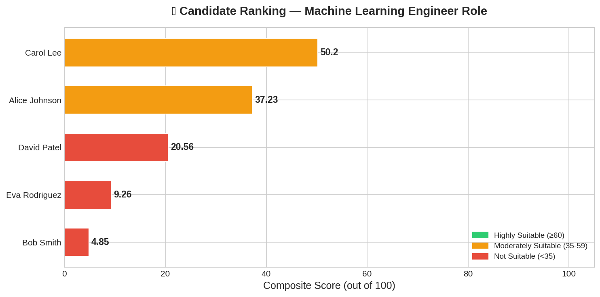
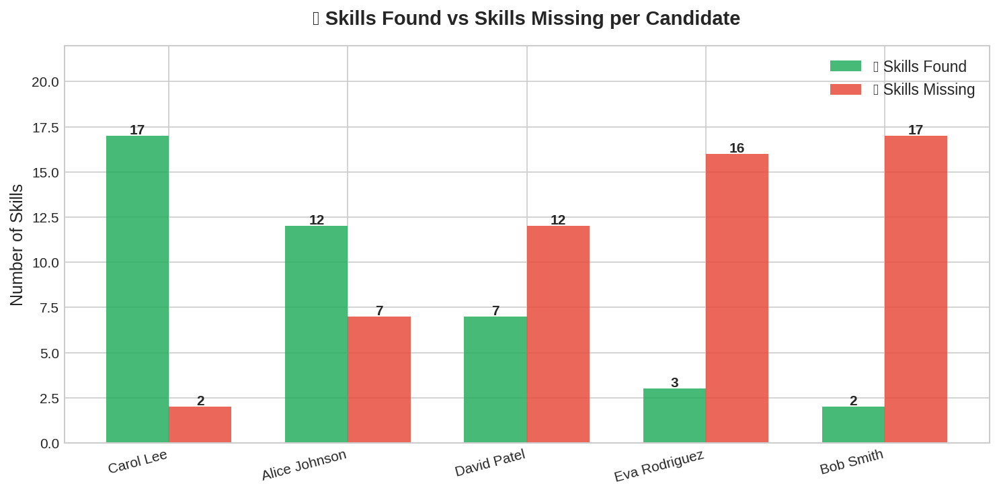
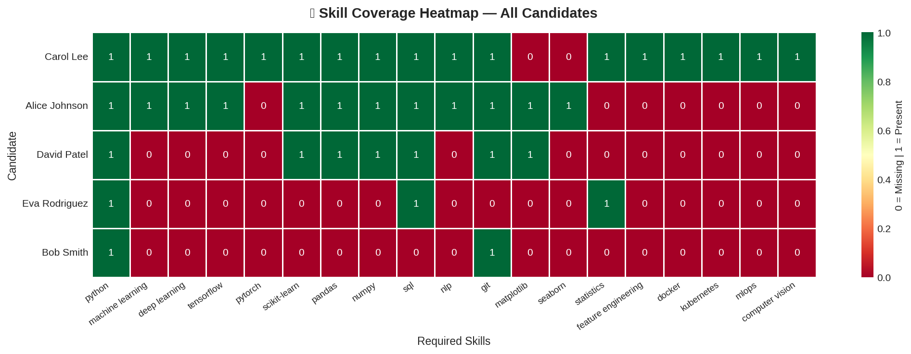
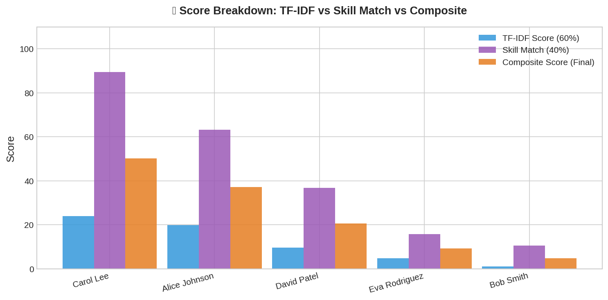

# 🤖 Resume / Candidate Screening System
### Future Interns — Machine Learning Internship | Task 3


---

## 📌 Project Overview

An **ML-powered Resume Screening System** that automatically parses, scores, and ranks candidate resumes against a given job description using **TF-IDF**, **Cosine Similarity**, and **Skill Gap Analysis**.

This project simulates a real-world HR screening tool used by companies to shortlist candidates efficiently.

---

## 🎯 Objectives

- Automatically parse and clean resume text
- Extract and match skills against job requirements
- Score candidates using ML-based similarity (TF-IDF + Cosine Similarity)
- Rank candidates by composite fit score
- Identify skill gaps for each candidate
- Visualize results with professional charts

---

## 🛠️ Tech Stack

| Tool | Purpose |
|------|---------|
| Python 3.10 | Core programming language |
| spaCy | NLP text processing |
| NLTK | Tokenization & lemmatization |
| Scikit-learn | TF-IDF vectorization & cosine similarity |
| Pandas | Data manipulation & export |
| Matplotlib | Data visualization |
| Seaborn | Heatmap visualization |

---

## 📂 Repository Structure

```
FUTURE_ML_03/
│
├── FUTURE_ML_03.ipynb          # Main Jupyter Notebook
├── resume_screening_results.csv # Exported ranking results
│
├── candidate_ranking.png        # Chart: Ranked candidates by score
├── skills_comparison.png        # Chart: Skills found vs missing
├── skill_heatmap.png            # Chart: Skill coverage heatmap
├── score_breakdown.png          # Chart: TF-IDF vs Skill vs Composite
│
└── README.md
```

---

## ⚙️ How It Works

```
Resume Text
    │
    ▼
Text Cleaning & Preprocessing (stopwords, lemmatization)
    │
    ▼
Skill Extraction (keyword matching against required skills list)
    │
    ▼
TF-IDF Vectorization + Cosine Similarity with Job Description
    │
    ▼
Composite Score = (TF-IDF × 60%) + (Skill Match × 40%)
    │
    ▼
Candidate Ranking + Skill Gap Report
```

---

## 📊 Results

| Rank | Candidate | Composite Score | Skill Match | Suitability |
|------|-----------|----------------|-------------|-------------|
| 🥇 1 | Carol Lee | 50.2 / 100 | 89.47% | 🟡 Moderately Suitable |
| 🥈 2 | Alice Johnson | ~40 / 100 | ~63% | 🟡 Moderately Suitable |
| 3 | David Patel | ~25 / 100 | ~47% | 🔴 Not Suitable |
| 4 | Eva Rodriguez | ~15 / 100 | ~21% | 🔴 Not Suitable |
| 5 | Bob Smith | ~10 / 100 | ~10% | 🔴 Not Suitable |

**🏆 Top Recommendation: Carol Lee** — 89.47% skill match, only missing Matplotlib & Seaborn.

---

## 📈 Visualizations

### 1. Candidate Ranking


### 2. Skills Found vs Missing


### 3. Skill Coverage Heatmap


### 4. Score Breakdown


---

## 🚀 How to Run

### Option 1 — Google Colab (Recommended)
1. Open `FUTURE_ML_03.ipynb` in [Google Colab](https://colab.research.google.com)
2. Run all cells top to bottom
3. Results and charts will be generated automatically

### Option 2 — Local Setup
```bash
git clone https://github.com/Abdur-Raqeeb07/FUTURE_ML_03.git
cd FUTURE_ML_03
pip install spacy nltk scikit-learn pandas matplotlib seaborn
python -m spacy download en_core_web_sm
jupyter notebook FUTURE_ML_03.ipynb
```

---

## 🧠 Key Learnings

- How to apply **NLP preprocessing** (tokenization, lemmatization, stopword removal)
- Building a **TF-IDF pipeline** for text similarity scoring
- Combining **rule-based skill matching** with **ML similarity** for better accuracy
- Creating **business-ready visualizations** from ML outputs
- Real-world understanding of **ATS (Applicant Tracking Systems)**

---

## 📜 Internship Details

| Field | Details |
|-------|---------|
| Organization | Future Interns |
| Track | Machine Learning |
| Task | Task 3 — Resume Screening System |
| Repo Code | FUTURE_ML_03 |
| Mode | Remote / Self-paced |

---

## 👤 Author

**Abdur Raqeeb**
- GitHub: [@Abdur-Raqeeb07](https://github.com/Abdur-Raqeeb07)

---

*Built with 💙 as part of the Future Interns Machine Learning Internship Program*

